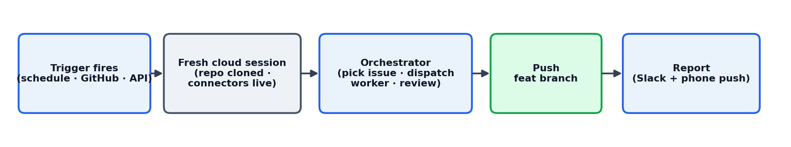
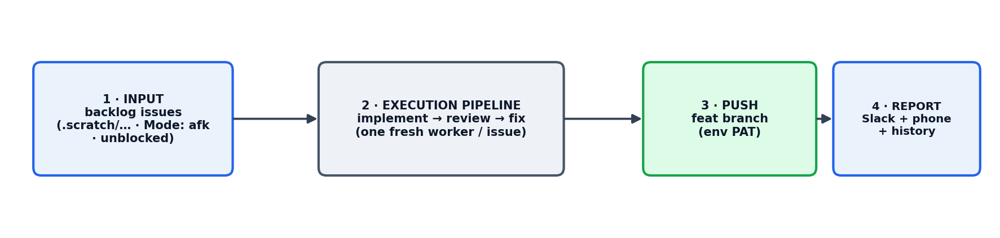
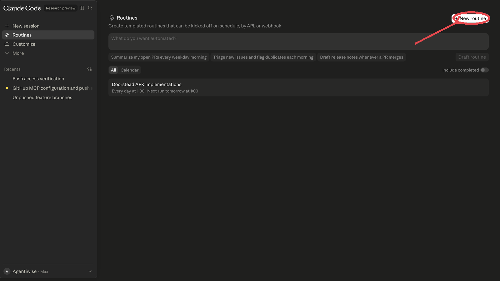
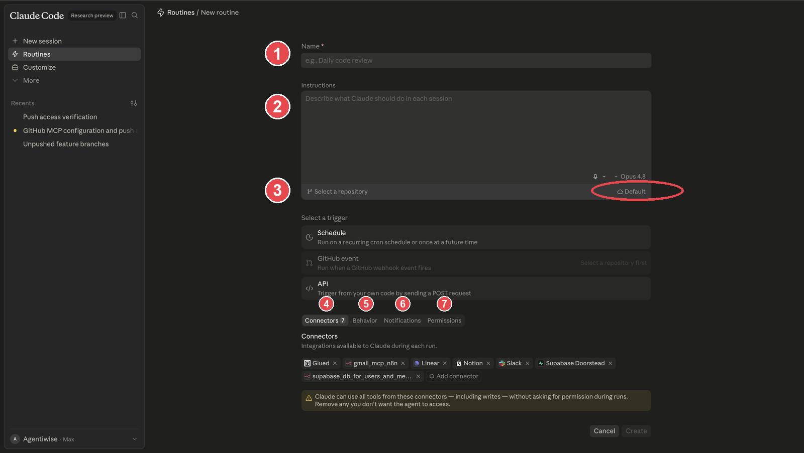
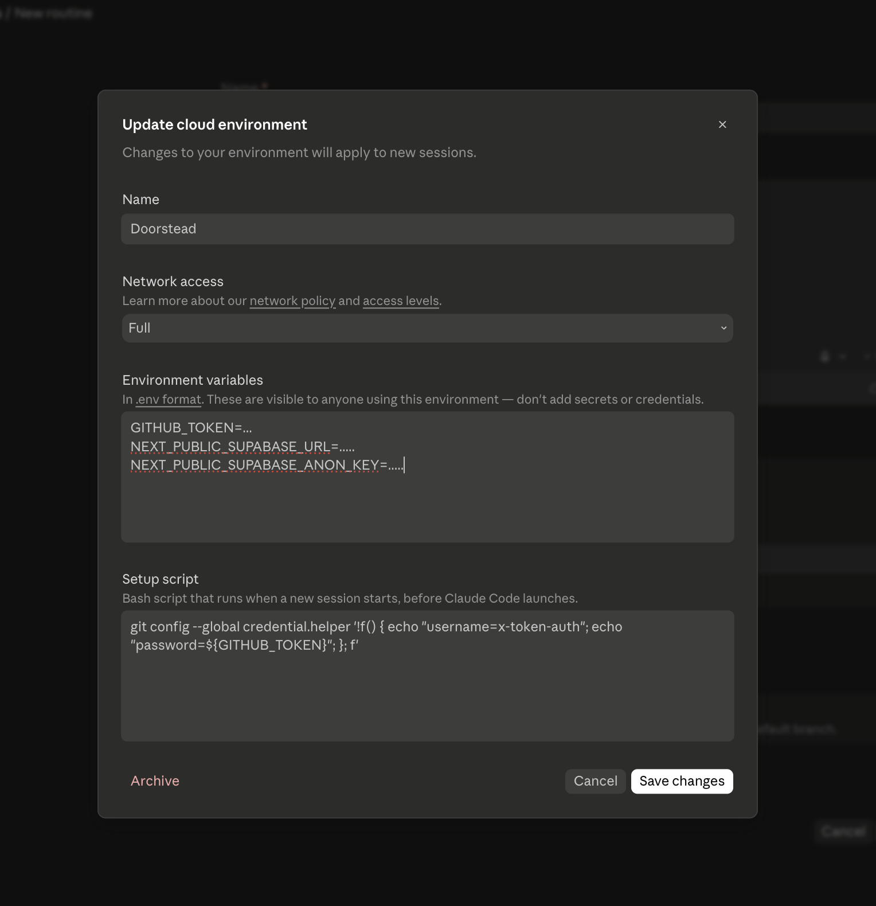
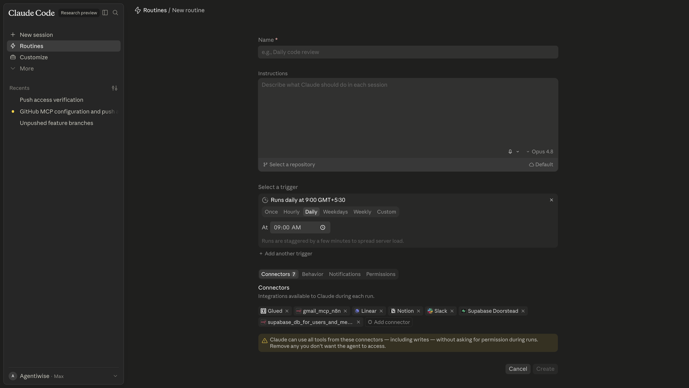
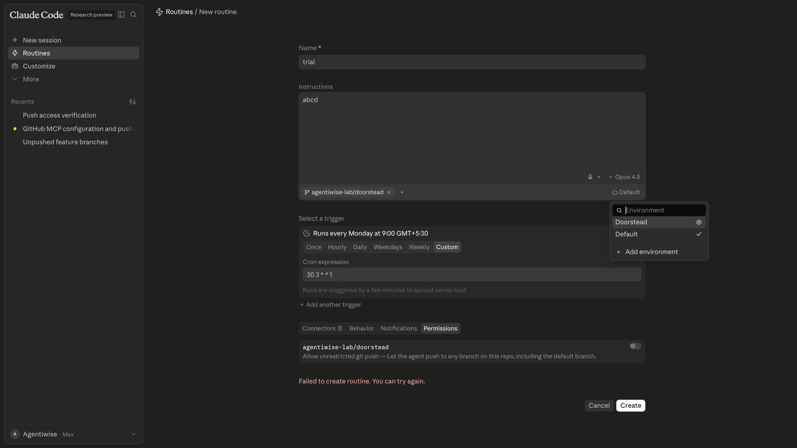

# AFK Coding on Cloud

_Taking the loop off your machine. You are on `08_begin`._

Doorstead's engineering loop has run locally so far, with you at the keyboard. This is the **AFK** ("away from keyboard") step: a **Claude Cloud Routine** runs the same loop cold on a schedule, in a fresh cloud container, and raises reviewable PRs while you are offline. The cloud provides the sandbox, the scheduler, the connectors, per-run isolation, run history, and phone notifications. You bring one thing: a well-harnessed prompt.

## Starting point
The next feature, buyer-accounts, is fully drafted: brief, PRD, plan, plan-review, and a dependency-ordered set of Linear issues (`AGE-121` to `AGE-124`), all produced in the Conductor thread and cut from `main`. It is an independent feature, its own line, so this branch carries only its planning docs, not the image-uploads work.

## The job
Configure a Claude Cloud Routine that runs the orchestrator prompt cold on a schedule. It lists the ready buyer-accounts issues from Linear, gates the destructive ones for sign-off, dispatches one fresh worker per issue (each worker self-reviews with `/review-code`, then the orchestrator reviews again independently), and raises reviewable PRs. It never touches `main` and never runs a destructive change without a human's sign-off. The routine prompt lives at `doorstead/docs/prompts/afk-routine.md`.

---

## 1. What a Routine is

- A **Routine** is a saved, templated Claude Code session that fires on a trigger.
- Each fire is a **cold, fresh cloud session**: it clones the repo, reads its instructions, runs, and reports.
- Nothing carries between fires except what you wrote to the repo. **Cold-every-time** is what makes an AFK loop safe and idempotent.
- Inside a fire it runs an **orchestrator plus workers**:
  - the **orchestrator** (your prompt) never writes code. It triages the backlog, dispatches **one fresh worker per issue**, reviews the result, and reports.
  - each **worker** is a fresh context that resolves exactly one issue with `/implement` (or `/diagnose` first for a bug), self-reviews its own diff with `/review-code`, then hands back a status.

**Anatomy of one fire:**



The orchestrator prompt is in [`doorstead/docs/prompts/afk-routine.md`](doorstead/docs/prompts/afk-routine.md).

---

## 2. The four steps of an AFK loop

Zoom out from the UI: every unattended loop runs in four steps. Get all four right and it runs itself; miss one and it stalls or goes rogue.



1. **Input**: a machine-readable backlog the loop can select from without a human. Here it is the **Linear** Doorstead project, gated by status (Backlog or Todo), dependency order (`Blocked by`), and the `destructive` / `destructive:signed-off` labels. Vague or unbounded input is what breaks autonomous loops first.
2. **Execution pipeline**: implement, then review, then fix. One fresh worker per issue, with a **bounded** fix loop (one pass, then escalate, never grind). The worker self-reviews, and the orchestrator reviews again at the top for a second perspective.
3. **Push**: land the work on a `feat/<slug>` branch, never `main`. From a routine this needs the PAT (see **Git push from a routine**).
4. **Report**: tell a human what happened and surface anything deferred (Slack, a phone push, and the platform's run history).

---

## 3. Connectors, the pillars of the routine

Connectors are the tools the run may call, and they run with **write access and no per-call prompt**. Attach the ones this repo's routine needs:

- **The repository**: the core pillar. The run edits code and pushes a branch. Git push from a routine needs the PAT setup (see **Git push from a routine**).
- **Linear**: to read the ready issues, claim them with a status change, and comment the outcome back.
- **Slack**: to post the end-of-run report to a channel.
- **Supabase**: Doorstead's database. Attach it only when the routine's job needs **data or schema changes**, not just code changes.

> A database connector runs with write access and no prompt, so the unattended loop can change your data or schema. Scope it to the non-prod dev project and attach it only when the routine's job genuinely needs it.

---

## 4. The components of true AFK

Six things must be decided before a routine is safe to run unattended:

1. **Trigger**: when it fires, a cron schedule, a GitHub event, or an API call. For a night shift, a recurring cron (for example `30 3 * * 1` is 03:30 Monday).
2. **Issue source**: where work comes from. Here it is **Linear** (team AGE, project Doorstead). The routine picks ready issues (Backlog or Todo, dependency-resolved, not destructive-unsigned), the same selection the local loop makes.
3. **Human-in-the-loop gate**: decided in **both** places. `CLAUDE.md` holds the repo-wide "never do X" rules, and the **orchestrator prompt** says where to stop. A worker stops and returns `needs-human` for exactly two things, a destructive database change or a regression of a live feature, and never guesses; a destructive issue runs only when it carries `destructive:signed-off`.
4. **Permissions and guardrails**: which connectors are attached (see **Connectors**), what the Permissions tab withholds, and the git-push PAT (see **Git push from a routine**).
5. **Notifications**: a phone push (and a Slack post) when it finishes or needs you (see **Notifications**).
6. **Monitoring**: the platform keeps the run history and logs for you; nothing to build.

---

## 5. Create a Routine

### Step 1: open Routines and start one
Go to **[Routines](https://claude.ai/code/routines)** and click **New routine** (circled).



### Step 2: fill the form
The numbered callouts, in the order you fill them:



1. **Name** the routine.
2. **Instructions**: paste the orchestrator prompt ([`afk-routine.md`](doorstead/docs/prompts/afk-routine.md)).
3. **Repository and environment**: pick the repo the run works in, and the cloud environment it boots into (the ringed **Default** picker). Open the environment to set network access, environment variables (including the git-push PAT, see **Git push from a routine**), and the setup script:

   

4. **Connectors**: attach only what the job needs (see **Connectors, the pillars of the routine**).
5. **Trigger**: Schedule, GitHub event, or API. For a night shift, a cron:

   

6. **Behavior** and **Permissions** tabs: behaviour settings, and grant or withhold risky abilities. Note: the **"allow unrestricted git push"** permission **currently errors**. Leave it, and give the run push access through the PAT (see **Git push from a routine**) instead.

   

### Step 3: create it
Hit **Create**. It now fires on the trigger you chose.

---

## 6. Git push from a routine, the PAT setup

Inside a Claude routine, **enabling git push currently errors**: the run can commit locally but the push is blocked, and the "allow unrestricted git push" toggle (the Permissions step in **Create a Routine**) does not work yet. The working bypass:

1. Create a GitHub **PAT** (fine-grained, scoped to the target repo, **read and write** on contents) so the routine can push branches.
2. Add it to the routine's **environment variables** (for example `GITHUB_TOKEN`).
3. In the environment's **setup script**, wire it into git's credential helper so pushes authenticate automatically, for example:
   ```bash
   git config --global credential.helper \
     '!f() { echo "username=x-access-token"; echo "password=${GITHUB_TOKEN}"; }; f'
   ```
4. The orchestrator prompt then pushes `feat/<slug>` normally: the credentials come from the environment, so the run never handles the token inline.

> The PAT lives in the environment, not the prompt or the repo. Scope it to the one repo and to the branches the routine needs.

---

## 7. Harnessing the loop: `CLAUDE.md` plus the prompt

Guardrails come from **both** homes and they compose. The test: would a human running `/implement` interactively also have to obey it? If yes, it belongs in `CLAUDE.md`. If it is only about how this unattended run behaves, it belongs in the prompt.

**In `CLAUDE.md` (repo-wide invariants), be concrete, not "be careful":**

- **No destructive git history**: never force-push, rewrite published commits, or drop commits.
- **No destructive DB changes**: never drop, truncate, or rewrite data or schema in a way that loses information.
- **Every issue follows the `/to-issues` format**: What to build, Acceptance criteria, Blocked by, and a Branch block, so an unattended run can pick it up self-contained.
- **Test behaviour at the contract boundary, use fakes not mocks**: a test reads like a line from the spec and survives a refactor.
- **Never commit to `main`**: every change on `feat/<slug>`.

**In the orchestrator prompt (this run's policy), concrete stop conditions, not vibes:**

- **Hard defer gate**: stop and return `needs-human` for exactly two things, a destructive database change or a regression of a live feature. A destructive issue runs only when it carries `destructive:signed-off`. Every other decision (a UI detail, a storage choice) the worker makes itself.
- **Two reviews, two perspectives**: the worker self-reviews its diff with `/review-code` before returning; the orchestrator reviews it again at the top.
- **Bounded fix loop**: one fix-worker pass per issue, then escalate, never spawn a second.
- **One fresh worker per issue**: two issues sharing a `feat/<slug>` branch are serialized.
- **Compact after each resolved-and-marked issue** so the orchestrator stays in the smart zone across a long backlog.

---

## 8. Notifications

- The orchestrator ends with a **PushNotification**. Allow the Claude Code **notification permission** on your phone so a run that needs a human reaches you.
- If Slack is attached, the end-of-run summary is posted to the channel.
- Everything else (per-fire history, logs) is in the Routines UI, no custom logging needed.

---

## Result
- A saved Claude routine running the loop cold on a schedule, guardrailed.
- It drains the buyer-accounts backlog (`AGE-121` to `AGE-124`) into reviewable PRs while you are offline, each on a `feat/buyer-accounts` branch cut from this state.
- State lives in the branch and the issues, so each run resumes cold and is safe to repeat.

## Check
```bash
git checkout 08_end
git diff 08_begin..08_end
cat doorstead/docs/prompts/afk-routine.md
```
